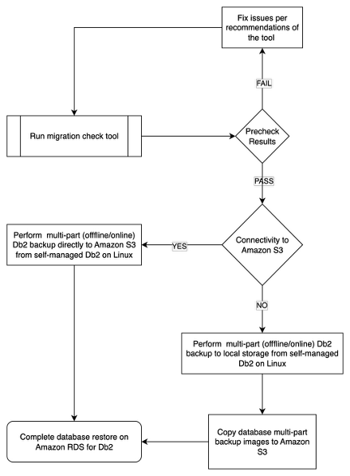

# Restore self-managed Db2 Linux databases in Amazon RDS for Db2

## Introduction
As more organizations migrate their self-managed Db2 Linux-based workloads to  [Amazon Relational Database Service (Amazon RDS) for DB2](https://aws.amazon.com/rds/db2/), , migration teams are learning that preparation is key to avoiding project delays. Common roadblocks include outdated database versions, invalid objects, and improper storage configurations that surface during the  migration process. 

In this post, we introduce a a [DB2 Migration Prerequisites Validation Tool](https://github.com/aws-samples/sample-rds-db2-tools/tree/main/tools/migrationprecheck) that catches these issues before they impact your timeline. This tool performs thorough pre-migration validation and guides you through the necessary preparations for migrating self-managed Db2 on Linux to Amazon RDS for Db2.

## Solution overview
The Db2 Migration Prerequisites Validation Tool performs comprehensive pre-migration assessments across various validation categories to ascertain migration readiness. Upon identifying any discrepancies, the tool offers specific, actionable recommendations for remediation. These detailed insights facilitate database administrators and migration teams in systematically addressing potential issues. The identified problems must be resolved prior to creating the final on-premises Db2 backup, which will be used for restoration in Amazon RDS for Db2. 

This proactive approach substantially diminishes the likelihood of migration failures to provide a seamless transition to the RDS environment. For more details on the one-time migration process from self-managed Db2 on Linux to Amazon RDS for Db2, refer to [Migrating from Linux to Linux for Amazon RDS for Db2](https://docs.aws.amazon.com/AmazonRDS/latest/UserGuide/db2-one-time-migration-linux.html).

The following diagram illustrates the general process flow to facilitate successful restoration from an on-premises, self-managed Db2 database on Linux to Amazon RDS for Db2.



The tool offers the following key features:

### **Cross-Platform Support**
- AIX, Linux on x86, Linux on POWER
- Compatible with older bash versions
- No external dependencies beyond standard Unix tools
- For non-Linux platforms or other migration options, consider using [Db2 Migration Tooling (Db2MT)](https://github.com/IBM/db2-db2mt)
- For more details about migration, refer to [Migrate from self-managed Db2 to Amazon RDS for Db2 using AWS DMS and Data migration strategies to Amazon RDS for Db2](https://aws.amazon.com/blogs/database/data-migration-strategies-to-amazon-rds-for-db2/)

### **Multiple Operation Modes**
- **Interactive Mode**: Guided experience with user prompts
- **Non-Interactive Mode**: Automated execution for scripting
- **Remote Mode**: Connect to remote DB2 databases for validation

### **Comprehensive Reporting**
- Color-coded console output
- Detailed log files with timestamps
- PASS/FAIL/WARNING status for each check
- Actionable recommendations for failures

### **Inventory Analysis**
- Complete database object inventory
- Sanity checks for migration readiness
- Object count summaries by type

You can use the tool in the following scenarios:

- **Pre-migration planning** – To identify potential issues early and allocate time for remediation.
- **Migration readiness assessment** – To perform a final validation before initiating the migration process to Amazon RDS for Db2.
- **After fixpack upgrades** – Validate databases after applying DB2 fixpacks to confirm proper update completion.
- **Before taking final DB2 backups** – To confirm readiness before restoring to Amazon RDS for Db2, a clean output can safeguard against restore. We provide general guidance on using the database backup command later in this post.


## How to use the tool

### **Prerequisites**

Before getting started, note the following prerequisites and limitations:

#### **Local Mode**
- DB2 instance must be running and accessible
- User must have SYSADM or SYSMAINT authority
- DB2 environment properly sourced (`. ~/sqllib/db2profile`)
- Run as the DB2 instance user (e.g., `db2inst1`)

#### **Remote Mode**
- DB2 client must be installed and configured
- Network connectivity to remote DB2 server
- Valid DB2 user credentials with DBADM or SYSMAINT privileges
- Database must be cataloged or DSN entries available in db2dsdriver.cfg file

In an interactive flow, the tool completes the following steps:

1. Display DB2 version information.
2. List available instances.
3. Identify current instance for validation. 
4. Discover local databases in current instance.
5. Validate remote databases when you cannot run the script on the Db2 server.
6. Allow database selection for validation. 
7. Execute comprehensive validation checks. 
8. Generate a detailed report.


## The Solution: DB2 Migration Prerequisites Validation Tool

Our validation tool performs comprehensive pre-migration checks across multiple categories:

- **Database Update Level Validation**
- **Invalid Objects Detection**
- **Tablespace State Verification**
- **Storage Configuration Validation**
- **Database Configuration Checks**
- **Log Configuration Analysis**
- **Federation Compatibility Assessment**
- **Database Inventory Analysis**


### **Local Interactive Mode Usage**

Direct execute of the tool
```bash
curl -sL https://bit.ly/precheckdb2migration | bash -s -- --verbose
```

Download and execute
```bash
curl -sL https://bit.ly/precheckdb2migration -o db2_migration_prereq_check.sh
chmod +x db2_migration_prereq_check.sh
./db2_migration_prereq_check.sh --verbose
```

### **Remote Mode Usage**

Direct execute of the tool. 

```bash
# Set environment variables for remote connection
export DB2USER=myuser
export DB2PASSWORD=mypassword
export DBNAME=mydatabase
curl -sL https://bit.ly/precheckdb2migration | bash -s -- --verbose
```

Download and execute

```bash
curl -sL https://bit.ly/precheckdb2migration -o db2_migration_prereq_check.sh
chmod +x db2_migration_prereq_check.sh

export DB2USER=myuser
export DB2PASSWORD=mypassword
export DBNAME=mydatabase
# Run validation against remote database
./db2_migration_prereq_check.sh --verbose

# Alternative: Set variables inline
DB2USER=myuser DB2PASSWORD=mypassword DBNAME=mydatabase ./db2_migration_prereq_check.sh
```

Note: The `DBNAME` environment variable used for remote connection must be either locally catalogued remote database name or name of the DSN entry used in the `db2dsdriver.cfg` file.

**Local Interactive Flow:**
1. Tool displays DB2 version information
2. Lists all available instances
3. Identifies current instance for validation
4. Discovers databases in current instance
5. Allows database selection for validation
6. Executes comprehensive validation checks
7. Generates detailed report

**Remote Mode Flow:**
1. Tool connects to specified remote database
2. Validates connection and user privileges
3. Executes comprehensive validation checks on remote database
4. Generates detailed report with remote connection details

### **Non-Interactive Mode Usage**

#### **Local Non-Interactive Mode**
```bash
# Validate specific instance
DB2_INSTANCES=db2inst1 ./db2_migration_prereq_check.sh

# With custom report location
DB2_INSTANCES=db2inst1 REPORT_FILE_PATH=/opt/reports/db2_check.log ./db2_migration_prereq_check.sh

# Verbose output for debugging
DB2_INSTANCES=db2inst1 ./db2_migration_prereq_check.sh --verbose
```

#### **Remote Non-Interactive Mode**
```bash
# Validate remote database with custom report
DB2USER=myuser DB2PASSWORD=mypassword DBNAME=mydatabase REPORT_FILE_PATH=/opt/reports/remote_db2_check.log ./db2_migration_prereq_check.sh

# Multiple remote databases (run separately for each)
for db in SAMPLE TESTDB PRODDB; do
    DB2USER=myuser DB2PASSWORD=mypassword DBNAME=$db ./db2_migration_prereq_check.sh
done
```

### **Multi-Instance Validation**

Run this tool separately in each instance.

```bash
#!/bin/bash
# Validate multiple instances
INSTANCES=("db2inst1" "db2inst2" "db2inst3")
REPORT_DIR="/var/log/db2_migration_checks"
mkdir -p "$REPORT_DIR"

for instance in "${INSTANCES[@]}"; do
    echo "Validating instance: $instance"
    su - "$instance" -c "
        . ~/sqllib/db2profile
        export REPORT_FILE_PATH='$REPORT_DIR/${instance}_migration_check.log'
        /path/to/db2_migration_prereq_check.sh
    "
done
```

## Understanding the Validation Checks

### **1. DB2 Version Information**
```
[   INFO] DB2 Level Information:
[   INFO]   Product is installed at "/opt/ibm/db2".
[   INFO]   Informational tokens are "DB2 v11.5.9.0", "s2310270807", "DYN2310270807AMD64"
```
**Purpose**: Provides version details for compatibility verification with RDS DB2.

### **2. Validating databases**
```
[SUCCESS] [Makes sure that you run db2updv115 -d DB2DB command] PASS - after applying fixpack before migrating to RDS DB2
```
**What it reminds**: Make sue to run `db2updv115 -d <database>` to verify database update completion.
**Common failure**: `db2updv115` not run after fixpack installation.

### **3. In-Doubt Transactions Check**
```
[SUCCESS] [INDOUBT_TRANSACTIONS] PASS - No in-doubt transactions found (0)
```
- **SQL Query**: `SELECT NUM_INDOUBT_TRANS FROM TABLE(MON_GET_TRANSACTION_LOG(NULL))`
- **CLP Command**: `db2 list indoubt transactions with prompting`
- **What it means**: An indoubt transaction is one that has been prepared but not yet committed or rolled back. All transactions must be committed or rolled back.

### **4. Invalid Objects Validation**
```
[  ERROR] [INVALID_OBJECTS] FAIL - Found 5 invalid object(s)
[WARNING] [INVALID_OBJECTS] RECOMMENDATION: Run: db2 "call SYSPROC.ADMIN_REVALIDATE_DB_OBJECTS()" (may need multiple runs)
```
- **SQL Query**: `SELECT 'COUNT:' || COUNT(*) FROM SYSCAT.INVALIDOBJECTS`
- **SQL Command**: `: db2 "call SYSPROC.ADMIN_REVALIDATE_DB_OBJECTS()"`
- **Resolution**: Execute the recommended stored procedure until count reaches zero.

### **5. Tablespace State Check**
```
[SUCCESS] [TABLESPACE_STATE] PASS - All tablespaces are in NORMAL state
```
- **What it checks**: Ensures all tablespaces are in NORMAL state, not in backup, rollforward, or other transitional states.
- **Recommendation**: There are over 20 different tablespace states. Take corrective action accordingly. Refer to the IBM [documentation](https://www.ibm.com/docs/en/db2/12.1.0?topic=spaces-table-space-states) detailing different tablespace states.

### **6. Non-Fenced Routines Detection**
```
[  ERROR] [NON_FENCED_ROUTINES] FAIL - Found 3 non-fenced user routine(s)
[WARNING] [NON_FENCED_ROUTINES] RECOMMENDATION: Review and fence user routines before migration
```
- **What it checks**: Identifies user-created routines that run in non-fenced mode, which are not supported in RDS.
- **Recommendation**: Non-fenced routines are not permitted in Amazon RDS for Db2. Convert all the routines to fenced.

### **7. AutoStorage Configuration Check**
```
[SUCCESS] [AUTOSTORAGE] PASS - Found 2 storage path(s)
```
- **SQL Query**: `SELECT TRIM(COUNT(*)) FROM TABLE(ADMIN_GET_STORAGE_PATHS('', -1))`
- **Requirement**: At least one storage group must exist for RDS compatibility.
- **Recommendation**: `db2 "CREATE STOGROUP <name> ON '<PATHname>'"`

### **8. Database Configuration Validation**
```
[SUCCESS] [DATABASE_CONFIG] PASS - All critical database configuration parameters are valid
```
**Parameters checked**:
- Update to database level pending: Must be NO
- Backup pending: Must be NO
- Rollforward pending: Must be NO
- Restore pending: Must be NO
- Upgrade pending: Must be NO

### **9. Log Configuration Analysis**
```
[   INFO] Log configuration: LOGFILSIZ=4096, LOGPRIMARY=13, LOGSECOND=12
[   INFO] Total log space: 400MB
[SUCCESS] [LOG_CONFIG] PASS - Log configuration valid for archived logging (total logs: 25 ≤ 4096)
```
**Validation Rules**:
- Non-archived logging: `LOGPRIMARY + LOGSECOND ≤ 254`
- Archived logging: `LOGPRIMARY + LOGSECOND ≤ 4096`

### **10. Database size Analysis**

**Database sizing**:
- **Recommendation**: Refer to the RDS_SIZING_TIER variable in `db2_migration_prereq_report_yyyymmdd_hhmmss.log`.

### **11. Federation Compatibility Check**
```
[WARNING] [FEDERATION] WARNING - Some federation wrappers may not be supported by RDS DB2
[   INFO] [FEDERATION] RECOMMENDATION: Review federation configuration - only DB2 LUW, iSeries, and z/OS are supported
```
**Supported**: `libdb2drda.so`, `libdb2rcodbc.so`
**Not Supported**: Sybase, Informix, Teradata wrappers

### **12. Java Stored Procedures**
- If JAR files are defined in your database (`sysibm.sysjarcontents`), then add JAR files to the RDS for Db2 instance (if needed).
- **Recommendation**:
  - **Install**: `call sqlj.install_jar('jar-url', 'jar-id')` → Example: `call sqlj.install_jar('file:/home/rdsdb/Common.jar', 'COMMON')`
  - **Replace**: `call sqlj.replace_jar(‘jar-url’, ‘jar-id’)` → Example: `call sqlj.install_jar('file:/home/rdsdb/Common.jar', 'COMMON')`
  - **Remove**: `call “sqlj.remove_jar(‘jar-id’ )` → Example: `call sqlj.remove_jar('COMMON')`
  

## Reading and Acting on Reports

### **Report Structure**

#### **Local Mode Report**
```
============================================================================
MIGRATION READINESS SUMMARY
============================================================================
Database: SAMPLE
Instance: db2inst1
Checks performed: 15
Passed: 15
Warnings: 0
Failed: 0
Informational: 47

DATABASE READINESS: READY
Database SAMPLE passed all checks
```

#### **Remote Mode Report**
```
============================================================================
MIGRATION READINESS SUMMARY
============================================================================
Mode: Remote Connection
Database: SAMPLE
User: myuser
Checks performed: 15
Passed: 15
Warnings: 0
Failed: 0
Informational: 47

DATABASE READINESS: READY
Database SAMPLE passed all checks
```

### **Migration Readiness Levels**

#### **READY FOR MIGRATION**
- All checks passed (PASS status)
- No critical issues found
- Database ready for backup and restore

#### **REVIEW REQUIRED**
- Some warnings found
- Manual review of recommendations needed
- Migration possible with considerations

#### **NOT READY FOR MIGRATION**
- Critical failures found
- Must address failed checks before migration
- Migration should not proceed

### **Action Items by Check Result**

#### **FAIL: Invalid Objects**
```bash
# Connect to database
db2 connect to SAMPLE

# Run revalidation (may need multiple executions)
db2 "call SYSPROC.ADMIN_REVALIDATE_DB_OBJECTS()"

# Verify resolution
db2 -x "SELECT count(*) FROM SYSCAT.INVALIDOBJECTS"
```

#### **DB2 Update Level**
- Make sure you’re using the latest Amazon RDS for Db2 software to create an RDS for Db2 instance. IBM has a [documented problem](https://www.ibm.com/mysupport/s/defect/aCIKe0000004DBZOA2/dt381784?language=en_US) in using the `db2updv115` tool causing an Db2 instance crash, and the fix is available in the Amazon RDS for Db2 software latest release. 
- This is one of the most common RDS Db2 restore failures.
There is not a good way to validate if db2updv115 tool was run on the database.

```bash
# Run database update utility on the Db2 server
db2updv115 -d SAMPLE
```

#### **FAIL: Missing Storage Groups**
```bash
# Create storage group
db2 "CREATE STOGROUP SG_DEFAULT ON '/db2/storage'"

# Verify creation
db2 "SELECT * FROM TABLE(ADMIN_GET_STORAGE_PATHS('', -1))"
```

#### **FAIL: Tablespace States**
```bash
# Check specific tablespace issues
db2 "SELECT TBSP_NAME, TBSP_STATE FROM TABLE(SYSPROC.MON_GET_TABLESPACE('', -1)) WHERE TBSP_STATE <> 'NORMAL'"

# Address specific state issues (varies by state)
# Example for backup pending:
db2 backup database SAMPLE
```

## Best Practices

### **1. Run Early and Often**
- Execute during migration planning phase
- Re-run after any database changes
- Validate immediately before backup creation

### **2. Address Issues Systematically**
- Fix FAIL items first (blocking issues)
- Review WARNING items for potential risks
- Document any INFO items for reference

### **3. Automate for Multiple Databases**
- Use non-interactive mode for automation
- Create scripts for multi-instance environments
- Schedule regular validation runs

### **4. Maintain Documentation**
- Keep validation reports for audit trails
- Document remediation actions taken
- Track validation history over time

## Advanced Usage Scenarios

### **Continuous Integration Integration**

#### **Local Mode CI/CD**
```bash
#!/bin/bash
# CI/CD pipeline integration for local instances
DB_VALIDATION_EXIT_CODE=0

for instance in $(db2ilist); do
    su - "$instance" -c "
        . ~/sqllib/db2profile
        /path/to/db2_migration_prereq_check.sh
    " || DB_VALIDATION_EXIT_CODE=1
done

if [ $DB_VALIDATION_EXIT_CODE -ne 0 ]; then
    echo "DB2 validation failed - blocking deployment"
    exit 1
fi
```

#### **Remote Mode CI/CD**
```bash
#!/bin/bash
# CI/CD pipeline integration for remote databases
DB_VALIDATION_EXIT_CODE=0
REMOTE_DATABASES=("SAMPLE" "TESTDB" "PRODDB")

for db in "${REMOTE_DATABASES[@]}"; do
    echo "Validating remote database: $db"
    DB2USER="$CI_DB2_USER" DB2PASSWORD="$CI_DB2_PASSWORD" DBNAME="$db" \
        /path/to/db2_migration_prereq_check.sh || DB_VALIDATION_EXIT_CODE=1
done

if [ $DB_VALIDATION_EXIT_CODE -ne 0 ]; then
    echo "Remote DB2 validation failed - blocking deployment"
    exit 1
fi
```

### **Scheduled Monitoring**

#### **Local Mode Monitoring**
```bash
#!/bin/bash
# Cron job for regular local validation
# 0 2 * * 1 /path/to/weekly_db2_validation.sh

REPORT_DIR="/var/log/db2_weekly_checks"
mkdir -p "$REPORT_DIR"
DATE=$(date +%Y%m%d)

for instance in $(db2ilist); do
    su - "$instance" -c "
        . ~/sqllib/db2profile
        export REPORT_FILE_PATH='$REPORT_DIR/${instance}_${DATE}.log'
        /path/to/db2_migration_prereq_check.sh
    "
done

# Send summary email
mail -s "Weekly DB2 Validation Report" admin@company.com < "$REPORT_DIR/summary_${DATE}.txt"
```

#### **Remote Mode Monitoring**
```bash
#!/bin/bash
# Cron job for regular remote validation
# 0 3 * * 1 /path/to/weekly_remote_db2_validation.sh

REPORT_DIR="/var/log/db2_remote_weekly_checks"
mkdir -p "$REPORT_DIR"
DATE=$(date +%Y%m%d)
REMOTE_DATABASES=("SAMPLE" "TESTDB" "PRODDB")

for db in "${REMOTE_DATABASES[@]}"; do
    echo "Validating remote database: $db"
    DB2USER="$MONITOR_DB2_USER" DB2PASSWORD="$MONITOR_DB2_PASSWORD" DBNAME="$db" \
        REPORT_FILE_PATH="$REPORT_DIR/remote_${db}_${DATE}.log" \
        /path/to/db2_migration_prereq_check.sh
done

# Send summary email
mail -s "Weekly Remote DB2 Validation Report" admin@company.com < "$REPORT_DIR/remote_summary_${DATE}.txt"
```

## Troubleshooting Common Issues

### **"DB2 command not found"**
```bash
# Ensure DB2 environment is sourced
. ~/sqllib/db2profile

# Verify DB2 installation
which db2
echo $DB2INSTANCE
```

### **"No DB2 instances found"**
```bash
# Check if instances are running
db2ilist

# Verify user permissions
whoami
id
```

### **"Unable to connect to database"**

#### **Local Mode**
```bash
# Activate database
db2 activate db SAMPLE

# Check database status
db2 list active databases
```

#### **Remote Mode**
```bash
# Test remote connection
db2 connect to SAMPLE user myuser using mypassword

# Check if database is cataloged
db2 list database directory

# Verify DSN configuration (if using)
cat $HOME/sqllib/cfg/db2dsdriver.cfg
```

### **Permission Errors**
```bash
# Ensure running as DB2 instance user
su - db2inst1

# Verify authorities
db2 "SELECT * FROM TABLE(SYSPROC.AUTH_LIST_AUTHORITIES_FOR_AUTHID('DB2INST1'))"
```

## Enhanced JSON Inventory Generation

The validation tool generates comprehensive JSON inventory files using `jq` for proper formatting and validation. In remote mode, inventory files are prefixed with "remote_" to distinguish them from local mode outputs. The JSON output includes:

### **Complete Database Object Inventory**
- **Basic Objects**: tables, views, materialized query tables, indexes, triggers, functions, procedures, methods, sequences, schemas
- **Constraints**: check constraints, primary keys, foreign keys  
- **Security Features**: LBAC labels/policies, RCAC tables, row permissions, column masks, roles, grants
- **Data Complexity**: aliases, data types, BLOB/CLOB/DBCLOB/XML columns, inline LOBs/XML
- **Storage Complexity**: SMS/DMS tablespaces, storage groups
- **Advanced Features**: column-organized tables, shadow tables

### **Multi-Database Support**
When multiple databases are analyzed, the tool generates a consolidated JSON with:
- Individual database inventories
- Instance-level summary with totals across all databases
- Proper JSON structure for programmatic processing

### **Fallback Compatibility**
On systems without `jq` (like AIX), the tool automatically falls back to basic JSON generation while maintaining functionality.

## Restoring Databases in Amazon RDS for DB2

After completing prerequisite validation and taking database backups, you can restore your databases to Amazon RDS for DB2 using two methods: **offline restore** and **online restore**. Additionally, RDS for DB2 now supports **S3 streaming** for improved performance and reduced storage requirements.

### **Offline vs Online Restore**

#### **Offline Restore**
- Database is unavailable during restore operation
- Faster restore process as no concurrent access
- Recommended for initial migrations
- Suitable for maintenance windows

#### **Online Restore** 
- Database remains available for read operations during restore
- Longer restore time due to concurrent access handling
- Minimal downtime for applications
- Ideal for production environments requiring high availability

### **Storage Requirements**

#### **With S3 Streaming (Recommended)**
```sql
-- Enable S3 streaming restore
db2 "call rdsadmin.set_configuration('USE_STREAMING_RESTORE', 'TRUE')"
```
**Storage needed**: A minimum of 10% of total backup size

#### **Without S3 Streaming (Traditional)**
**Storage needed**: Equal to or greater than the backup size PLUS the original database size

### **Configuring Restore Performance**

Optimize restore performance by configuring these parameters:

```sql
-- Check current configuration
db2 "call rdsadmin.show_configuration()"

-- Set restore parallelism
db2 "call rdsadmin.set_configuration('RESTORE_DATABASE_PARALLELISM', '4')"

-- Set number of buffers
db2 "call rdsadmin.set_configuration('RESTORE_DATABASE_NUM_BUFFERS', '8')"

-- Set multiple backup paths (for multi-file backups)
db2 "call rdsadmin.set_configuration('RESTORE_DATABASE_NUM_MULTI_PATHS', '5')"

-- Enable S3 streaming (recommended)
db2 "call rdsadmin.set_configuration('USE_STREAMING_RESTORE', 'TRUE')"
```

### **Restore Database Examples**

#### **Basic Offline Restore**
```sql
-- Offline restore from S3
db2 "call rdsadmin.restore_database(
    'SAMPLE',           -- database_name
    's3://my-bucket/backups/sample_backup.tar.gz',  -- s3_object_key
    'OFFLINE'           -- restore_mode
)"
```

#### **Online Restore with S3 Streaming**
```sql
-- Enable streaming first
db2 "call rdsadmin.set_configuration('USE_STREAMING_RESTORE', 'TRUE')"

-- Online restore with streaming
db2 "call rdsadmin.restore_database(
    'SAMPLE',           -- database_name  
    's3://my-bucket/backups/sample_backup.tar.gz',  -- s3_object_key
    'ONLINE'            -- restore_mode
)"
```

#### **Multi-File Backup Restore**
```sql
-- Configure for multiple backup files
db2 "call rdsadmin.set_configuration('RESTORE_DATABASE_NUM_MULTI_PATHS', '3')"
db2 "call rdsadmin.set_configuration('USE_STREAMING_RESTORE', 'TRUE')"

-- Restore from multiple files
db2 "call rdsadmin.restore_database(
    'SAMPLE',           -- database_name
    's3://my-bucket/backups/',  -- s3_prefix (folder containing multiple backup files)
    'OFFLINE'           -- restore_mode
)"
```

### **S3 Streaming Benefits**

#### **Reduced Storage Requirements**
- Traditional: Backup size + Database size
- Streaming: Less than 10% of the MAX(Backup size) and the Database size
- Up to 50% storage savings for large databases

#### **Improved Performance**
- Direct streaming using multiple path increase the download speed significantly
- Parallel streaming with multiple paths
- Reduced I/O overhead on RDS instance

#### **Enhanced Reliability**
- No intermediate storage failures
- Automatic retry mechanisms
- Better error handling and recovery

### **Prerequisites for S3 Streaming**

1. **DB2 Engine Version**: 11.5.9.0.sb00063198.r1 or higher
2. **S3 Connectivity**: Customer VPC must have S3 gateway endpoint enabled
3. **IAM Permissions**: RDS instance role needs S3 read permissions
4. **Network Configuration**: Ensure S3 endpoints are accessible

### **Monitoring Restore Progress**

```sql
-- Check restore status
db2 "SELECT * FROM TABLE(rdsadmin.show_restore_status())"

-- Monitor restore progress
db2 "call rdsadmin.show_configuration('RESTORE_DATABASE_STATUS')"

-- Check database state after restore
db2 "SELECT * FROM TABLE(MON_GET_DATABASE(-1))"
```

### **Best Practices for Database Restore**

#### **Pre-Restore Checklist**
1. ✅ Run prerequisite validation tool
2. ✅ Verify backup integrity
3. ✅ Configure restore parameters
4. ✅ Enable S3 streaming if supported
5. ✅ Ensure adequate storage space
6. ✅ Plan for maintenance window (offline restore)

#### **During Restore**
1. Monitor restore progress regularly
2. Check for error messages in logs
3. Avoid unnecessary database operations
4. Keep backup files accessible until completion

#### **Post-Restore Validation**
```sql
-- Make sure to run runstats on all tables and indexes
DB_NAME="YOUR_DATABASE_NAME"
SCHEMA_NAME="YOUR_SCHEMA_NAME"
DB2USER="<master user name>"
DB2PASSWORD="<master user password>"

# Connect to Amazon RDS for Db2 database from a Db2 client
db2 "connect to $DB_NAME user <masterusername> using <masteruserpassword>"

# Get a list of all tables in the specified schema
db2 -x "SELECT TABNAME FROM SYSCAT.TABLES WHERE TABSCHEMA = '$SCHEMA_NAME' AND TYPE = 'T'" > tableslist.txt
TABLES=$(cat tableslist.txt)
for TABLE in $TABLES
do
  echo "Running RUNSTATS on table $SCHEMA_NAME.$TABLE and its indexes..."
  db2 "RUNSTATS ON TABLE $SCHEMA_NAME.$TABLE WITH DISTRIBUTION AND INDEXES ALL"
done

-- Check database configuration
db2 "call rdsadmin.show_configuration()"

-- Validate critical objects
db2 "SELECT COUNT(*) FROM SYSCAT.INVALIDOBJECTS"
```

### **Troubleshooting Restore Issues**

#### **Common Error: Insufficient Storage**
```
SQL20157N  The database backup cannot be restored because there is insufficient storage space.
```
**Solution**: 
- Enable S3 streaming to reduce storage requirements
- Increase RDS instance storage
- Verify storage calculations

#### **Common Error: S3 Access Denied**
```
SQL20XXX  Cannot access S3 object. Access denied.
```
**Solution**:
- Verify IAM role permissions
- Check S3 bucket policies
- Ensure Customer ENI has S3 connectivity

#### **Common Error: Backup File Corruption**
```
SQL20XXX  The backup image is corrupted or invalid.
```
**Solution**:
- Verify backup file integrity
- Re-create backup from source
- Check S3 object metadata

## Migration Workflow Integration

Integrate the validation tool into your complete migration workflow:

```bash
#!/bin/bash
# Complete DB2 to RDS Migration Workflow

# Step 1: Pre-migration validation
echo "Step 1: Running prerequisite validation..."
./db2_migration_prereq_check.sh
if [ $? -ne 0 ]; then
    echo "Validation failed. Address issues before proceeding."
    exit 1
fi

# Step 2: Create backup
echo "Step 2: Creating database backup.... Use multiple paths. If in doubt, use 20 paths"
db2 backup database SAMPLE to /backup/path,/backup/path,/backup/path compress

# Step 3: Upload to S3
echo "Step 3: Uploading backup to S3..."
aws s3 cp /backup/path/SAMPLE.*backup* s3://my-migration-bucket/backups/

# Step 4: Configure RDS for restore
echo "Step 4: Configuring RDS restore parameters..."
db2 "call rdsadmin.set_configuration('USE_STREAMING_RESTORE', 'TRUE')"
db2 "call rdsadmin.set_configuration('RESTORE_DATABASE_PARALLELISM', '20')"

# Step 5: Restore database
echo "Step 5: Restoring database to RDS..."
db2 "call rdsadmin.restore_database('SAMPLE', 's3://my-migration-bucket/backups/SAMPLE.backup', 'OFFLINE')"


echo "Migration completed successfully!"
```

## General guidance on using database backup command

When using the database backup command, consider the following best practices:

- Amazon RDS for Db2 uses [Amazon Simple Storage Service](http://aws.amazon.com/s3) (Amazon S3) streaming capabilities to restore the database using parallel streams. Amazon S3 streaming is most effective when dealing with multi-part files of the database backup image. For instance, the command `db2 backup database <dbname> to /backup` will generate a single image of the database, which might not be optimal from a performance standpoint. Instead, use multiple locations in the command, such as `db2 backup database to /backup, /backup, /backup, /backup, /backup`. This example demonstrates that the database backup operation will be executed in parallel, resulting in the database image being divided into five parts, each labeled as `.001`, `.002`, `.003`, `.004`, and `.005`.
- Consider employing multi-part backup even for smaller databases. Determine the number of database locations based on your Linux machine’s CPU and memory capabilities. In cases of uncertainty, it is advisable to use 20 locations.
- Consider using Db2 backup directly to Amazon S3 if you have connectivity from self-managed Db2 to the AWS Region’s network. To copy database multi-part images to Amazon S3, you must create a bucket in your account with the necessary privileges. Use this bucket to create a [Db2 storage access alias](https://www.ibm.com/docs/en/db2/11.5.x?topic=commands-catalog-storage-access).
  - Considerations for creating storage alias:
    - If using Db2 on EC2, grant proper IAM role to access the Amazon S3 bucket and then do not specify `USER`, `PASSWORD` or `TOKEN` in the create storage alias command. Example command: `db2 "CATALOG STORAGE ACCESS ALIAS <aliasName> VENDOR S3 SERVER https://s3.<region>.amazonaws.com" CONTAINER <container-name> DBUSER <masterUserName>`
    - If using self-manage Db2, you can get the AWS CLI credentials and create the storage alias.
      - **Using log-term credentials:**   `db2 "CATALOG STORAGE ACCESS ALIAS <aliasName> VENDOR S3 SERVER s3.<region>.amazonaws.com USER $AWS_ACCESS_KEY_ID PASSWORD $AWS_SECRET_ACCESS_KEY CONTAINER <container-name> DBUSER <masterUserName>"`
      - **Using short-term credentials:** `db2 "CATALOG STORAGE ACCESS ALIAS <aliasName> VENDOR S3 SERVER s3.<region>.amazonaws.com USER $AWS_ACCESS_KEY_ID PASSWORD $AWS_SECRET_ACCESS_KEY CONTAINER <container-name> DBUSER <masterUserName> TOKEN $AWS_SESSION_TOKEN"`
- Use the storage alias in the backup command to directly write database backup images to Amazon S3. For instance, if the storage alias created is `db2S3`, use the command `db2 backup database <dbname> to DB2REMOTE://db2S3, DB2REMOTE://db2S3, DB2REMOTE://db2S3, DB2REMOTE://db2S3, DB2REMOTE://db2S3`. This command will split database backup images into five parts in your S3 bucket.


## General guidance on using database restore command

When using the database restore command, consider the following best practices:

- Make sure that you have enabled [Amazon S3 integration for RDS for Db2 instances](https://docs.aws.amazon.com/AmazonRDS/latest/UserGuide/db2-s3-integration.html) with the proper [AWS Identity and Access Management](https://aws.amazon.com/iam/) (IAM) role for access to an S3 bucket with database backup multi-part copies.
- Use the stored procedure [`rdsadmin.set_configuration`](https://docs.aws.amazon.com/AmazonRDS/latest/UserGuide/db2-sp-managing-databases.html#db2-sp-set-configuration) to set performance parameters such as `RESTORE_DATABASE_NUM_BUFFERS`, `RESTORE_DATABASE_PARALLELISM`, and `RESTORE_DATABASE_NUM_MULTI_PATHS`. 
- Set the parameter `USE_STREAMING_RESTORE` to `TRUE` to enable Amazon S3 streaming direct from Amazon S3 to Amazon RDS for Db2.
- Amazon RDS for Db2 will create a Db2 storage alias automatically for restoring the database multi-part database backup images using the [`rdsadmin.restore_database`](https://docs.aws.amazon.com/AmazonRDS/latest/UserGuide/db2-sp-managing-databases.html#db2-sp-restore-database) stored procedure.
- Pay attention to the s3_prefix variable used in the `rdsadmin.restore_database` stored procedure. This prefix is the common part of multi-part backup images excluding extensions such as .001, .002, and so on so that matching files are restored to the RDS for Db2 database.
- If using online backup image, you must keep copying Db2 archive log files to Amazon S3 and run the stored procedure [`rdsadmin.rollforward_database`](https://docs.aws.amazon.com/AmazonRDS/latest/UserGuide/db2-sp-managing-databases.html#db2-sp-rollforward-database) to apply Db2 archive log files. Repeat the process until you have applied all log files. You should use a different prefix for each operation.
- After applying all log files, run the stored procedure [`rdsadmin.complete_rollforward`](https://docs.aws.amazon.com/AmazonRDS/latest/UserGuide/db2-sp-managing-databases.html#db2-sp-complete-rollforward) to bring the RDS for Db2 database in a connectible state.
- Consider using the [Db2MT tool](https://github.com/IBM/db2-db2mt) for automation for using online restore instead of manual steps.


## Enhancements to the tool
The source code of this tool is available in the [GitHub](https://github.com/aws-samples/sample-rds-db2-tools/tree/main/tools/migrationprecheck) repository. [Open an issue](https://github.com/aws-samples/sample-rds-db2-tools/issues) to submit your enhancements request or submit a [pull request](https://github.com/aws-samples/sample-rds-db2-tools/pulls) with your suggested changes.

## Conclusion

The Db2 Migration Prerequisites Validation Tool significantly reduces migration failures by identifying and addressing common issues before they impact your migration timeline. By incorporating this tool into your migration workflow, you can achieve the following:

- **Reduce migration risk**: Identify issues early in the process
- **Save time**: Avoid failed restore operations and troubleshooting  
- **Improve success rate**: Make sure databases are properly prepared
- **•Maintain documentation**: Keep detailed validation records

Regular use of this tool as part of your Db2 maintenance and migration processes can help facilitate smooth, successful migrations to Amazon RDS for Db2.

## Additional Resources

To learn more about Amazon RDS for Db2 and migration strategies, refer to the following resources:

-	**[Amazon RDS for Db2 User Guide](https://docs.aws.amazon.com/AmazonRDS/latest/UserGuide/CHAP_Db2.html)**
- **[AWS RDS for DB2 Documentation](https://docs.aws.amazon.com/AmazonRDS/latest/UserGuide/db2-sp-managing-databases.html)**
-	**[Data migration strategies to Amazon RDS for Db2](https://aws.amazon.com/blogs/database/data-migration-strategies-to-amazon-rds-for-db2/)**
- **[DB2 Migration Best Practices](https://docs.aws.amazon.com/AmazonRDS/latest/UserGuide/db2-one-time-migration-linux.html)**
-	**[Near zero-downtime migrations from self-managed Db2 on AIX or Windows to Amazon RDS for Db2 using IBM Q Replication](https://aws.amazon.com/blogs/database/performance-optimization-of-full-load-and-ongoing-replication-tasks-from-self-managed-db2-to-amazon-rds-for-db2/)**
-	**[Performance optimization of full load and ongoing replication tasks from self-managed Db2 to Amazon RDS for Db2](https://aws.amazon.com/blogs/database/performance-optimization-of-full-load-and-ongoing-replication-tasks-from-self-managed-db2-to-amazon-rds-for-db2/)**
-	**[Migrating tables from IBM Db2 for z/OS to Amazon RDS for Db2](https://aws.amazon.com/blogs/database/migrating-tables-from-ibm-db2-for-z-os-to-amazon-rds-for-db2/)**
- **[S3 Streaming Configuration Guide](https://docs.aws.amazon.com/AmazonRDS/latest/UserGuide/db2-sp-managing-databases.html#db2-sp-set-configuration)**
- **Tool Source Code**: Available for customization and enhancement

---

## About the authors
- [Vikram S Khatri](https://www.linkedin.com/in/viz7/) is a Sr. DBE for Amazon RDS for Db2. Vikram has over 20 years of experience in Db2. He enjoys developing new products from the ground up. In his spare time, he practices meditation and enjoys listening to podcasts.
- [Umair Hussain](https://www.linkedin.com/in/uhussain/) is a Senior Database Engineer for Amazon RDS for Db2. Umair has over 20 years of Db2 experience.
- [Rajib Sarkar](https://www.linkedin.com/in/rajibsarkaribm/) is a Senior Database Engineer for Amazon RDS for Db2. Rajib has over 20 years of Db2 experience.